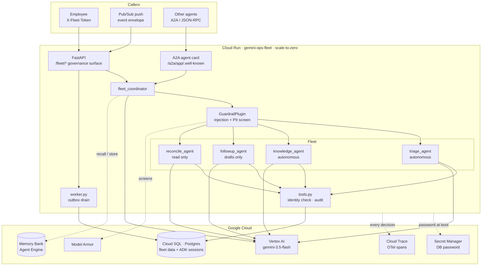
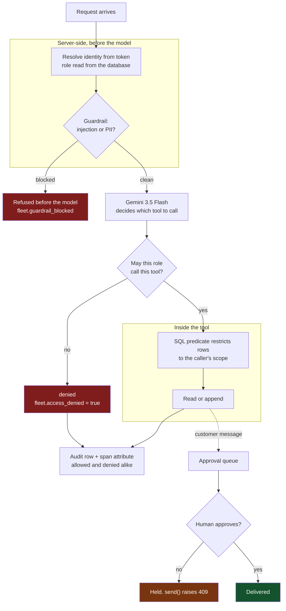
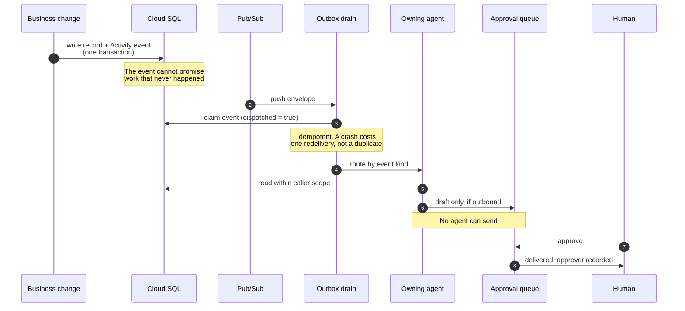

# Architecture

Three views. The first shows what runs where, the second shows how a request is
constrained, and the third shows how work happens with nobody watching. The
second and third are the ones that matter for the Fortified Enterprise Fleet
track — the first is just the map.

---

## 1. System

Two details in that picture are easy to miss and both were bugs first:

- **Cloud SQL is reached by two drivers.** ADK's session store runs on
  SQLAlchemy's asyncio extension and rejects a synchronous driver; the fleet's
  own repository code is synchronous. Same database, `asyncpg` for sessions and
  `pg8000` for everything else.
- **The employee token is not in `Authorization`.** Cloud Run's IAM layer
  consumes that header before the request reaches the app, so identity travels
  in `X-Fleet-Token`.

---

## 2. What makes a request safe

The interesting claim is not that the agents can act. It is what they cannot
reach. Every one of these gates is Python, not prompt text.

Read the diagram from the failure paths, because those are the product:

| Gate | Where it lives | Why it holds |
|---|---|---|
| Identity | `identity.py` | No tool takes a role, identity, or employee id argument. A test asserts this over every tool signature, so the model has no vocabulary for claiming a role. |
| Tool ACL | `identity.check_tool_access` | `reconcile_accounting` is restricted to accounting and management. A refusal is recorded, not swallowed. |
| Row scope | `retrieval.permitted_documents`, `identity.visible_customers` | A SQL `WHERE` clause, evaluated before rows exist. Filtering is security; ranking runs afterwards on the permitted set and is free to change. |
| Guardrail | `guardrails.GuardrailPlugin` | Registered on the `App`, so it covers every agent at once. A per-agent callback would leak the moment someone adds an agent. |
| Human gate | `approvals.py` | Not a tool. No agent has a path to `approve` or `send`, and `send` re-checks rather than trusting the caller. |

---

## 3. How work happens with nobody watching

An agent that waits for a prompt is a chatbot. The fleet consumes an event
stream instead.

Routing is a table, not a judgement call:

| Event | Owning agent | Autonomy |
|---|---|---|
| `as.opened` | `triage_agent` | autonomous |
| `as.resolved` | `knowledge_agent` | autonomous |
| `delivery.done` | `followup_agent` | drafts only |
| `transaction.posted` | `reconcile_agent` | read only |

An event with no owner is marked handled and logged rather than retried, so one
unrouted message cannot bury the queue behind it.

---

## What the traces carry

ADK already emits the execution skeleton. `app/tracing.py` adds the layer that
answers a different question — not *did it run* but *what was it allowed to do*:

| Attribute | Meaning |
|---|---|
| `fleet.caller_role` | Which department the call ran as |
| `fleet.authorization` | `allowed` or `denied` |
| `fleet.access_denied` | Set only on refusals, so they are findable without a filter |
| `fleet.guardrail_blocked` / `fleet.guardrail_reason` | What was stopped and why |
| `fleet.event_kind` / `fleet.routed_to` | Which agent picked up which event |
| `fleet.human_actor` | Who approved an outbound message |

Background dispatch opens its own root span. Without it, the asynchronous half
of the system has no incoming request to hang off and would be invisible.
